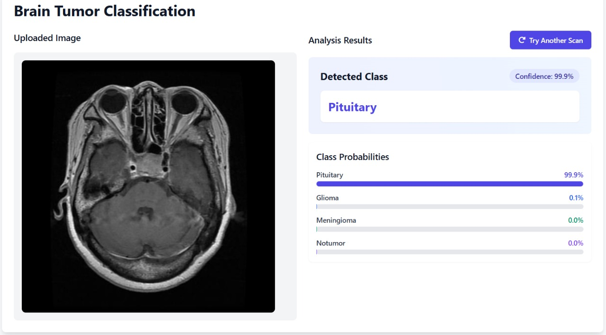

# Brain-Tumor-Detection

A deep learning-based system for classifying brain tumors using medical imaging.

## 🧠 Project Description

This project implements a brain tumor classification system using Convolutional Neural Networks (CNNs). It processes MRI scans to predict the presence and type of brain tumor. A user-friendly web interface is provided for ease of use by healthcare professionals or researchers.

## 🚀 Features

- ✅ Accurate brain tumor classification using deep learning
- 🌐 Web-based user interface built with Flask
- 📊 Interactive dashboard for predictions
- 🧠 Pre-trained model for fast and efficient inference

## 🗂️ Project Structure

Brain-Tumor-Detection/
├── app.py # Main Flask application
├── models/ # Trained deep learning model files
├── static/ # Static files (CSS, images, JavaScript)
├── templates/ # HTML templates for the UI
├── config/ # Configuration files (if any)
├── test.ipynb # Notebook for testing and development
├── requirements.txt # List of dependencies
└── README.md # Project documentation


## 🛠️ Installation

1. **Clone the repository**

```bash
git clone https://github.com/vg-gupta/Brain-Tumor-Detection.git
cd Brain-Tumor-Detection
```


2. **Install the required dependencies**
```bash
pip install -r requirements.txt
```

## ▶️ Usage
1. Run the application
```bash
python app.py
```
2. Access the web interface

Open your browser and go to: http://127.0.0.1:5000/

3. Upload an MRI image
Upload an image via the interface to classify it as a tumor or a non-tumor.


## 🧪 Testing
You can use test.ipynb to explore and test the model's performance and predictions on sample data.

## 📎 Requirements
All dependencies are listed in the requirements.txt file. Key libraries may include:
-Flask
-TensorFlow / Keras
-NumPy
-OpenCV
-Pandas

## 📌 Notes
-Ensure all necessary model files are present in the models/ directory.
=This tool is for educational and research purposes. Clinical use should follow medical regulations and validation.

## 🤝 Contributions
Pull requests are welcome. For major changes, please open an issue first to discuss your ideas.

## 📜 License
This project is open-source and available under the MIT License.
